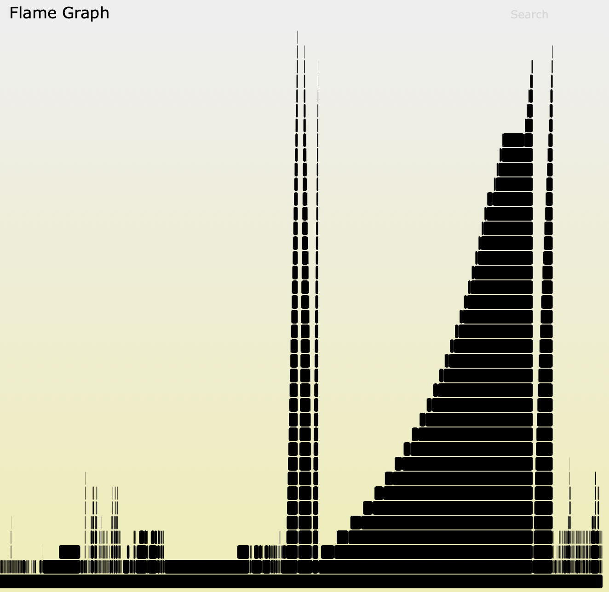
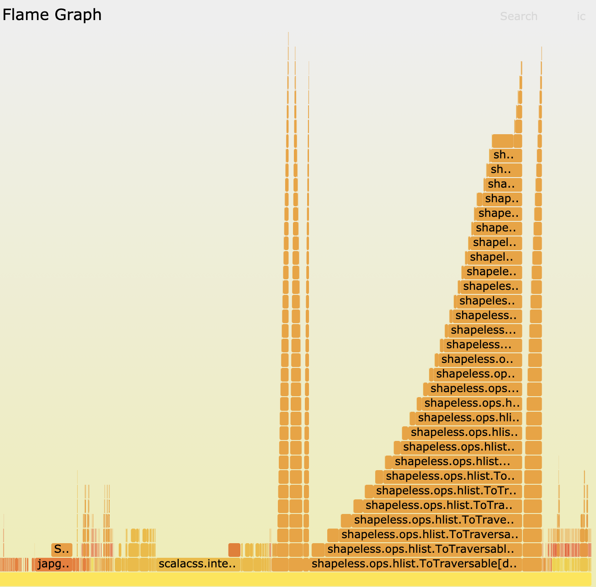

# Scala compiler profiling (2.13)
#### date: 05.02.2021 17:41

This a pure practical story of me trying to profile Scala compilation time.

There is a great article about this
topic: [SPEEDING UP COMPILATION TIME WITH SCALAC-PROFILING](https://www.scala-lang.org/blog/2018/06/04/scalac-profiling.html)

However, when I decided to try [scalac-profiling](https://github.com/scalacenter/scalac-profiling) out — I
run into a lot of troubles like:

```scala
  [error] java.lang.reflect.InvocationTargetException
  [error] sun.reflect.NativeConstructorAccessorImpl.newInstance0(Native Method)
  [error] sun.reflect.NativeConstructorAccessorImpl.newInstance(NativeConstructorAccessorImpl.java: 62)
  [error] sun.reflect.DelegatingConstructorAccessorImpl.newInstance(DelegatingConstructorAccessorImpl.java: 45)
  [error] java.lang.reflect.Constructor.newInstance(Constructor.java: 423)
  ...
```
or
```shell
[error] bad option: -P:scalac-profiling:no-profiledb
[error] bad option: -P:scalac-profiling:show-profiles
```

I will try to keep my story short as possible.

So, how to make it all work for Scala 2.13.

[scalac-profiling](https://github.com/scalacenter/scalac-profiling) is published only for Scala 2.12, but
thanks for Open Source community, there is a forked version of it compiled for
2.13 [here](https://gitlab.com/leonard.ehrenfried/scalac-profiling) (Huge thanks to Leonard Ehrenfried).

Now, step by step, they are very similar to original article. However....

1. Add `sbt-bloop` plugin to `plugins.sbt` and run 

```shell
sbt bloopInstall
``` 

2. Download forked version of `scalac-profiling`

```shell
coursier fetch --intransitive io.leonard:scalac-profiling_2.13:0.0.3
```

3. Provide `scalacOptions`. Instead of editing `bloop` files - I will just put them to my `build.sbt` directly.

```scala
scalacOptions ++= Seq(
  "-Xplugin:/Users/Home/Library/Caches/Coursier/v1/https/repo1.maven.org/maven2/io/leonard/scalac-profiling_2.13/0.0.3/scalac-profiling_2.13-0.0.3.jar",
  "-P:scalac-profiling:no-profiledb",
  "-P:scalac-profiling:show-profiles",
  "-P:scalac-profiling:sourceroot:/Users/Home/projects/scala-performance/.bloop"
)
```

4. Run `sbt compile` and you will see

```shell
...
Writing graph to /Users/User/projects/scala-performance/target/scala-2.13/classes/META-INF/profiledb/graphs/implicit-searches-1612543054297.flamegraph
```

5. Feed this file to [FlameGraph](https://github.com/brendangregg/FlameGraph) as described in the original article.

Be careful which color profile you use for `.flamegraph` visualisation, otherwise you can end up having graph like this:



Available colors for `./flamegraph.pl` are:
```shell
--colors PALETTE # set color palette. choices are: hot (default), mem,
	             # io, wakeup, chain, java, js, perl, red, green, blue,
	             # aqua, yellow, purple, orang
```

`hot` color profile looks like this:


